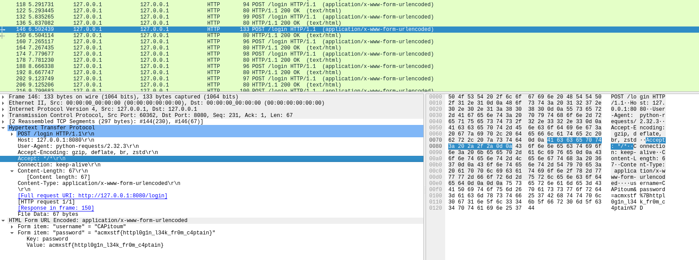

# Challenge: CAPitoum (ACM&xSTF CTF 2025)

## Forensics: PCAP Analysis 

### Description

It seems our team captain is a total n00b and forgot to encrypt the HTTP traffic while logging in. Can you find the leaked credentials?

### Solution

To solve this challenge, we began by analyzing the provided `.pcap` file using the `strings` command. This allowed us to extract readable content from the raw packet capture:

```
/POST /login HTTP/1.1
Host: 127.0.0.1:8080
User-Agent: python-requests/2.32.3
Accept-Encoding: gzip, deflate, br, zstd
Accept: */*
Connection: keep-alive
Content-Length: 32
Content-Type: application/x-www-form-urlencoded
u#h8
/username=trent&password=iloveyou
u#hA
u#hH
```

We noticed several HTTP POST requests, including this one that contained plaintext credentials.

To narrow down the search, we used `strings` in combination with `grep` to look for the flag pattern:

```bash
strings CAPitoum.pcap | grep acm
```

This revealed the correct credentials embedded in the HTTP payload:

```bash
strings CAPitoum.pcap | grep acm
username=CAPitoum&password=acmxstf%7Bhttpl0g1n_l34k_fr0m_c4ptain%7D
```

We also opened the file in `Wireshark` for inspection.

After filtering for `HTTP POST Requests` and inspecting them, we found the flag:



#### 🔓 Final Flag

```
acmxstf{httpl0g1n_l34k_fr0m_c4ptain}
```