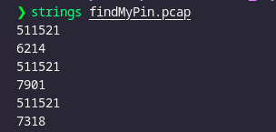

# Challenge: PinPoint1

## MISC: Strings command

### Description

We are presented with a small challenge that hints at having to find a "pin" or a short numeric key.

Given minimal information (presumably some encrypted or obscured data), we have to try different small values to find the correct one.

### Solution

🧠 Step-by-step:



- Based on the hint, we knew that only a few possible "keys" were available.
- Tried the 3 possible pin combinations suggested by the context.
- One of the attempts revealed the correct answer.

The correct flag is:

```
DawgCTF{7901}
```
