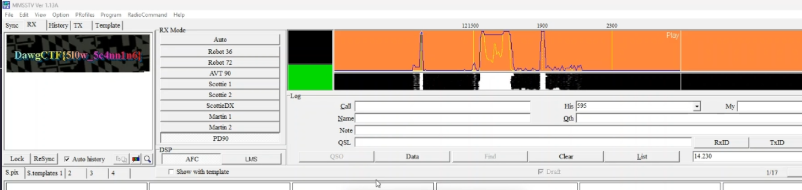

## Mystery Signal II

I was listening to my scanner when I noticed a strange transmission. Can you decode it?

## Solution

Listening carefully to the audio, it wasn't morse code — it sounded like **SSTV**!
To decode the image, I used **MMSSTV YONIQ**, the modern continuation of the classic MMSSTV software by JE3HHT, updated for today's radio amateurs.

I opened **MMSSTV YONIQ** (available at [http://mm-open.org](http://mm-open.org)) and used it to receive and decode the image from the audio file.

After decoding, this is what appeared:

