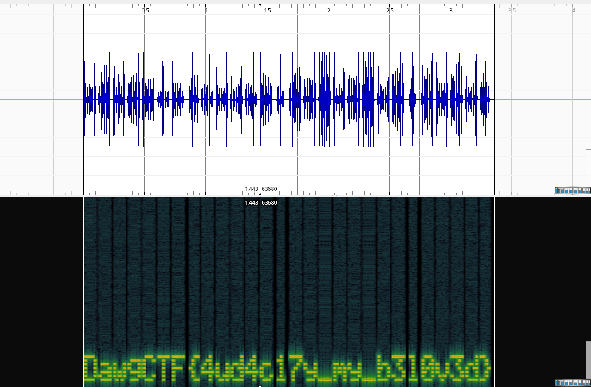

## Spectral Secrets

## Solution

Listening carefully to the audio, it wasn't morse code, SSTV, or DTMF tones — it sounded different, like something hidden in the frequencies!
To solve it, I used **Sonic Visualiser**, a free and powerful tool for analyzing audio spectrums.

I opened the audio file in **Sonic Visualiser** and applied a spectrogram view (Pane > Add Spectrogram) to see the hidden patterns visually.

After adjusting the settings to enhance the frequency bands, I could clearly make out text encoded in the spectrogram image.

Here’s what I found:

