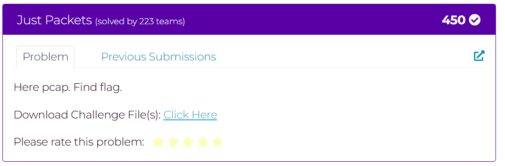

# Challenge: Just Packets

## MISC: Wireshark Packet Analysis



### Description

We are given a `.pcap` file containing network traffic. The challenge hints that everything we need is "just packets," suggesting that the flag is hidden within the network capture.

Using Wireshark, we inspect the traffic and find a long Base64 encoded text embedded within the packets.  
The text, when decoded, reveals a story about a village, an ancient flag, and a young girl named Elara.

However, hidden within the story, a line states:

> "The flag you seek is not in this story at all. It'd be a waste of time analysing this text further (seriously)."

This suggests that the actual flag is hidden elsewhere in the network capture and not embedded directly in the text.

### Solution

#### 🧠 Step-by-step:

- **Decoding the base64** reveals a narrative but no actual flag.
- Realizing the hint, we decide to search through the packets more carefully.

We use `tshark` to extract packets where the TCP **urgent pointer** flag is set, because it's an uncommon field and might be used to stealthily hide data.

Command used:

```bash
tshark -r traffic.pcap -Y "ip.src == 10.99.41.238 && tcp.flags.urg == 1" -T fields -e tcp.urgent_pointer
```

This command extracts urgent pointer values from packets sent by IP `10.99.41.238` where TCP urgent flag is set.

By reconstructing the urgent pointer values, we eventually get the flag:

```
DawgCTF{villagers_bonds}
```
