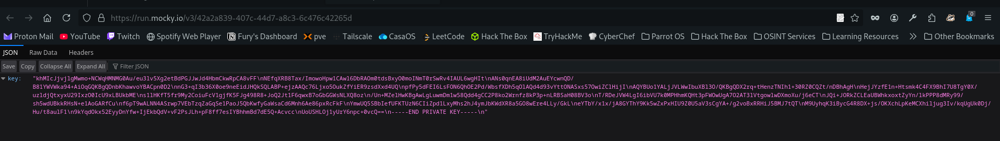

# Challenge: RevDroid (ACM&xSTF CTF 2025)

## Reverse Engineering: (Android)

### Description

I made this APK and it contains a cool secret! If you know what you're doing, the app will just give it to you... If you don't, you'll have to dig deep to find it.

---

### Solution

The goal of this challenge was to retrieve a flag from an Android app. The app's logic involved:

- Accepting a password from the user.
- Comparing its SHA-256 hash with a stored value.
- If correct, revealing a button that decrypts and displays the flag.

The app also includes **emulator detection** logic, terminating execution if it detects an emulated environment.

To analyze the app, we decompiled the APK using **JADX**, which gave us access to the Java source code. The first thing we looked at was the `MainActivity` class, where we found the following:

```java
private static final String ENCRYPTED_FLAG = "d2YSMu1nE41FlhwP6qWz7EmsAtM3z2f0BSFLJYzjpkpADExQLT2Sl3A4W7G6C0lF";
private static final String SECRET_HASH = "4d67cb99e57bc7d21345f94cc3baeb1be7da7009a8444a46fd36b70eae8beba5";
```

The app hashes the user's input with SHA-256 and compares it to `SECRET_HASH`. If the hashes match, it enables a hidden button which triggers:

```java
String decrypted = Utils.decryptFlag(ENCRYPTED_FLAG);
```

#### Decrypting the Flag

Upon diving into the Utils class, we see that it uses AES encryption:

```java
Cipher cipher = Cipher.getInstance("AES/ECB/PKCS5Padding");
SecretKeySpec secretKey = new SecretKeySpec(AES_KEY_RAW.getBytes(StandardCharsets.UTF_8), "AES");
```

However, `AES_KEY_RAW` is not hardcoded — it’s dynamically obtained from:

```java
AES_KEY_RAW = xercvtbuhniki75uj222222weyhe.getDecryptedAESKey();
```

This led us to analyze the xercvtbuhniki75uj222222weyhe class, where we found that the AES key itself was RSA-encrypted and stored as a Base64 string:

```java
private static final String ENCRYPTED_AES_KEY_BASE = "...";
```

To decrypt this AES key, the class reconstructs an RSA private key from multiple `partA()` to `partF()` methods. Once reconstructed, the AES key is decrypted via:

```java
cipher.init(Cipher.DECRYPT_MODE, privateKey);
byte[] aesKeyBytes = cipher.doFinal(encryptedKeyBytes);
```

When analyzing how the AES key was retrieved in `xercvtbuhniki75uj222222weyhe.java`, we noticed something important: while the private key looked like it was hardcoded in parts (`partA()` through `partE()`), `partF()` was actually retrieved at runtime from an **external URL**:

```java
private static String partF() {
    return abcdef.fetchPrivateKey();
}
```
Inside the abcdef class, the fetchPrivateKey() function performs an HTTP GET request to:

```
https://run.mocky.io/v3/42a2a839-407c-44d7-a8c3-6c476c42265d
```

This call uses a custom header `(X-Auth: CTF-ACCESS)` and expects a JSON object containing the final part of the RSA private key under the field "key".

#### ❌ CTF Roadblock

During the live event, this URL was unfortunately unreachable.
This meant we couldn't reconstruct the complete RSA private key needed to decrypt the AES key and thus the flag.

#### After the Event

The resource was made available as seen in



Once we had both the password and AES key, we decrypted the flag.

#### 🔓 Final Flag

```
acmxstf{Welcome_to_the_world_of_mobile_hacking}
```