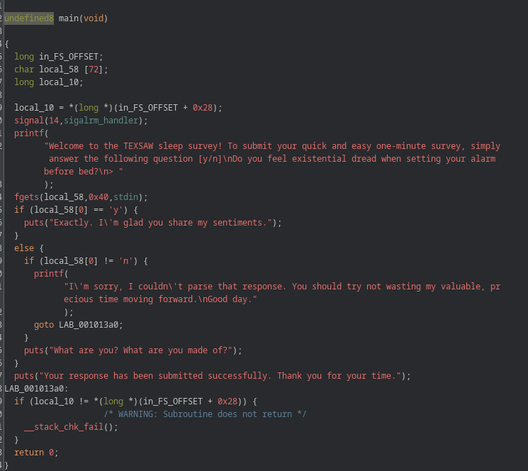

# Challenge: Too Early 4 Me TexSAW 2025

## Reverse Engineering: Signals

### Description

We are given a binary challenge that asks the user a simple "yes/no" question.  
At first glance, the program looks harmless, but after reversing it in Ghidra, we uncover hidden behavior triggered by a signal.



In the main function, we find:
```c
signal(14, sigalrm_handler);
```

This sets up a **signal handler** for **`SIGALRM`** (signal number 14).  
The handler, `sigalrm_handler`, is responsible for calling the `decode_flag` function.

The `decode_flag` function uses a substitution box (sbox) to **decode the flag** by reversing an encoded array.

Thus, **the real goal** is to send `SIGALRM` while the program is running to make it decode and print the flag.

### Solution

**Step 1: Understand Kill Signals**

📜 Common Types of Kill Signals:

| Signal Name | Number | Meaning |
|-------------|--------|---------|
| `SIGHUP`    | 1      | Hangup detected on terminal |
| `SIGINT`    | 2      | Interrupt (Ctrl+C) |
| `SIGQUIT`   | 3      | Quit from keyboard |
| `SIGILL`    | 4      | Illegal instruction |
| `SIGABRT`   | 6      | Abort signal |
| `SIGFPE`    | 8      | Floating-point exception |
| `SIGKILL`   | 9      | Force kill (cannot be caught) |
| `SIGSEGV`   | 11     | Segmentation fault |
| `SIGPIPE`   | 13     | Broken pipe |
| `SIGALRM`   | 14     | Alarm clock (timer expired) |
| `SIGTERM`   | 15     | Termination request |
| `SIGUSR1`   | 10     | User-defined signal 1 |
| `SIGUSR2`   | 12     | User-defined signal 2 |
| `SIGCHLD`   | 17     | Child stopped or exited |
| `SIGCONT`   | 18     | Continue if stopped |
| `SIGSTOP`   | 19     | Stop process (cannot be caught) |

Here, **we specifically use SIGALRM (14)**.

**Step 2: Running the File**

We launch the challenge file `chal`.  
It asks a question and waits for input.

While it's running, **we open another terminal** and search for the process:
```bash
ps -ef | grep chal
```

We find the running process (example PID 1902).

**Step 3: Sending SIGALRM**

We send the `SIGALRM` signal manually:
```bash
kill -SIGALRM 1902
```

**Result**: The `sigalrm_handler` is triggered, which calls `decode_flag()`, and the flag is printed out.

### Final Flag

```
texsaw{how_signalicious_much_swag}
```
